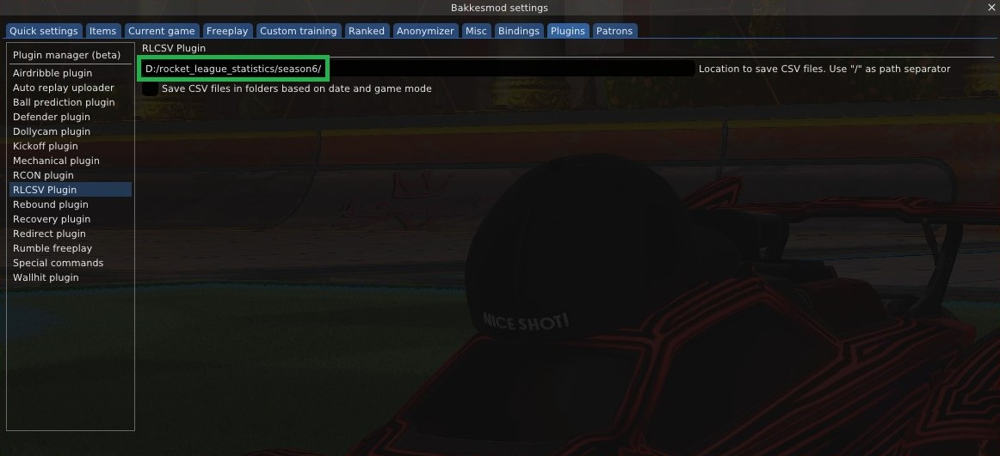
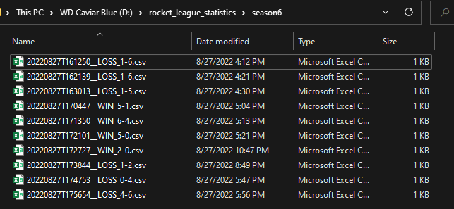

# User's Guide

## Introduction
The goal of the project is to streamline the process of retrieving/analyzing data from Rocket League games. The prerequisites for using the software are listed below:

&emsp;1.) Rocket League with BakkesMod installed your local machine. \
&emsp;2.) The [RLCSV plugin.](https://bakkesplugins.com/plugins/view/94) This is available at the embedded link or as a .zip in the repository. \
&emsp;3.) Python 3.10 (other versions may work, but this was developed using 3.10)
&emsp;&emsp;&emsp;a.) To check, open a terminal/command prompt and 

## How-To

&emsp;1.) Launch Rocket League and open the BakkesMod menu. \
&emsp;2.) Navigate to the ```Plugins``` menu, and then to the ```RLCSV Plugin``` entry. \
&emsp;3.) Follow the instructions on the plugin page and set the path to a location of your choice on your machine. Include the full path with drive letter, and use '/' as a delimiter per the RLCSV instructions.\
&emsp;&emsp;&emsp;a.) Be sure to include a trailing '/', otherwise the plugin will prepend the last characters of the path to each file name. \
&emsp;&emsp;&emsp;b.) Do NOT check the box for saving the files into folders based on date and gamemode.

<p align="center">
  
</p>

&emsp;4.) Play the games you want to record. At the conclusion of each game, the results will be saved as a .csv in the directory you specified in step 2. When you open the directory, it should look like the below figure.

<p align="center">
  
</p>

&emsp;5.) Download or clone the code from the repository. \
&emsp;6.) Navigate to the tools folder inside the repository. Shift + Right-Click in the empty space inside the folder and click Open PowerShell window here. \
&emsp;7.) Run the following command, replacing ```"INSERT_PATH_HERE"``` with the exact path entered during step 2:

```
python season-stats.py "INSERT_PATH_HERE"
```

&emsp;&emsp;If that doesn't work, try replacing ```py``` with ```python``` 

&emsp;8.) Navigate to the generated 'bin' folder.\
&emsp;9.) The desired output of season statistics is ```stats.csv```.

